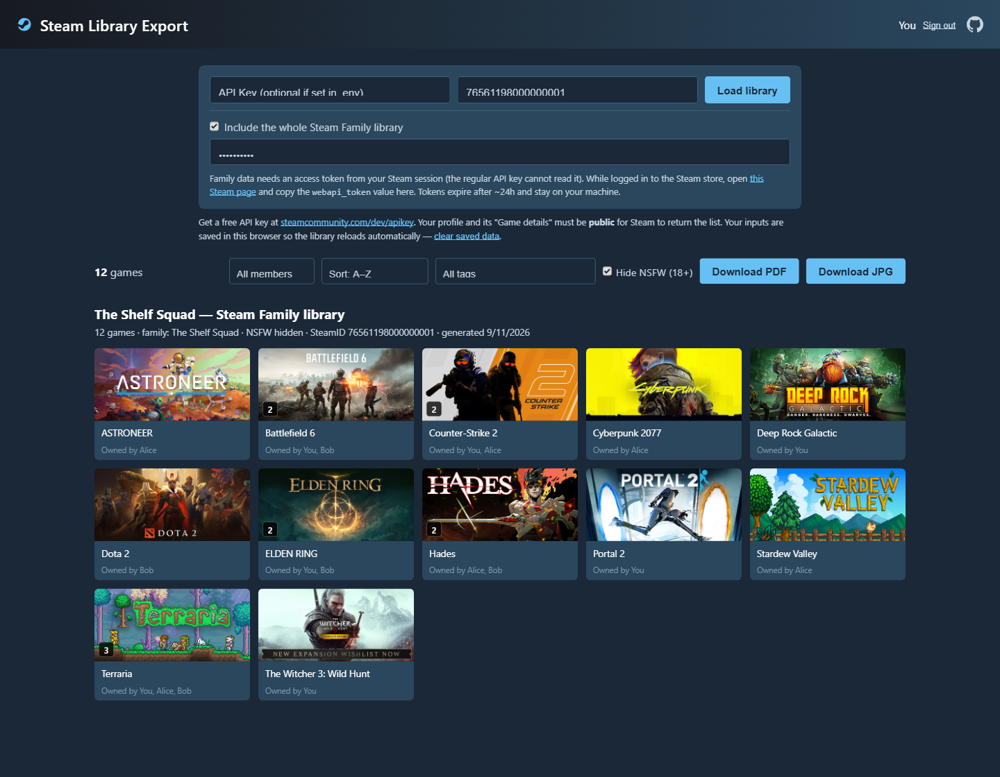
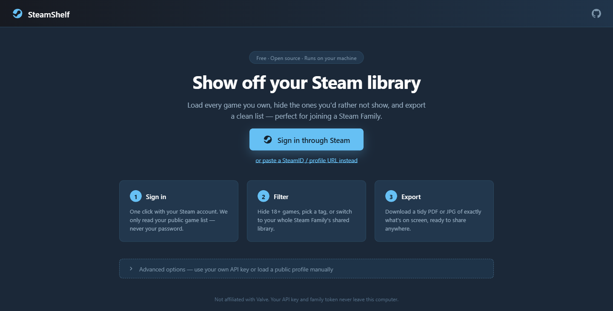

# 🎮 SteamShelf

**Show off your Steam library — and your whole Steam Family's — and export it as a PDF or JPG.**

Joining a Steam Family often starts with one question: *"what games do you bring?"* SteamShelf answers it in one click. It loads your full library with cover art, lets you filter out what you don't want to show, and exports a clean, shareable list. No game downloads, no account access — just the list.






## ✨ Features

- **Sign in through Steam** (OpenID) — or paste a SteamID64, profile name, or profile URL under *Advanced options*
- **Full library grid** with official cover art, including newer games hosted on Steam's hashed-asset CDN
- **Steam Family mode** *(opt-in)*: switch to the whole shared library with per-game owner badges, a copy-count badge on duplicates (just like Steam), member filter chips, sort by most copies, and a token status pill showing when family access renews
- **Search and tag filter** — instant name search, plus a tag dropdown built from your actual games ("Action (2385)") and scoped to the selected family member
- **NSFW filter** (on by default) using Steam's official content descriptors — hides adult-only games without flagging mainstream titles
- **Free-to-play badge and filter** — F2P games are labeled (they never count as family copies, since Steam doesn't share them) and hidden by default in family view
- **Library value** — an approximate USD total (current store prices) for whatever is on screen: your library, one family member's, or the whole family pool; member chips show each member's value on hover. Pick your country in the *Prices* selector to also see the total in your regional currency and sort by your store's real prices — the USD figure stays for easy sharing
- **Export exactly what you see** to a multi-page A4 **PDF** or a single **JPG**, with a header stating the filters applied, the library value, your SteamID, and the date
- **Session persistence** — your profile, family token, and settings survive page refreshes; sign out clears them
- **Mobile-friendly** — responsive grid and a fixed bottom export bar on small screens

## 🚀 Quick start

Requirements: Node.js 18+ and a free [Steam API key](https://steamcommunity.com/dev/apikey).

```bash
git clone https://github.com/cflarios/steam-shelf.git
cd steam-shelf
npm install
```

Copy `.env.example` to `.env` and paste your API key:

```
STEAM_API_KEY=YOUR_KEY_HERE
```

Build and run:

```bash
npm run serve
```

Open http://localhost:3000 and press **Sign in through Steam** — your library loads automatically. To load a profile manually (or use your own API key from the page), expand **Advanced options**.

> **Heads up:** your Steam profile and its "Game details" must be **public** (Profile → Edit Profile → Privacy Settings), otherwise Steam's API returns nothing.

## 👨‍👩‍👧‍👦 Steam Family mode

Steam's family endpoints don't accept a regular API key — they need an access token from your logged-in Steam session:

1. Switch to **"Family library"** — a dialog asks for the token the first time.
2. While logged in to the Steam store in your browser, open
   [store.steampowered.com/pointssummary/ajaxgetasyncconfig](https://store.steampowered.com/pointssummary/ajaxgetasyncconfig).
3. Copy the `webapi_token` value into the dialog.

Tokens expire after ~24 hours — the status pill shows when, and its **Update** link opens the dialog again. The token never leaves your machine: it goes from your browser to your local server, which only talks to the official Steam API.

## 🛠️ Development

Run the API and the Vite dev server (with hot reload) separately:

```bash
npm start     # Express API on :3000
npm run dev   # Vite dev server (proxies /api, /img and /auth)
```

## ⚙️ How it works

- The Express backend proxies the Steam Web API, so your key stays server-side.
- Tags, content descriptors, and image-asset hashes come from `IStoreBrowseService/GetItems` in batches of 200 and are cached on disk (`cache/`) — the first load of a big library takes a few seconds, the next ones are instant.
- Game covers are proxied through the local server, which resolves Steam's newer hashed asset paths and rejects the CDN's gray placeholder, so the canvas export works without CORS issues.
- Exports are rendered client-side with html2canvas + jsPDF.

## 📄 Disclaimer

SteamShelf is an unofficial tool and is not affiliated with Valve or Steam. All game artwork is served by Steam's own CDN and belongs to its respective owners.
